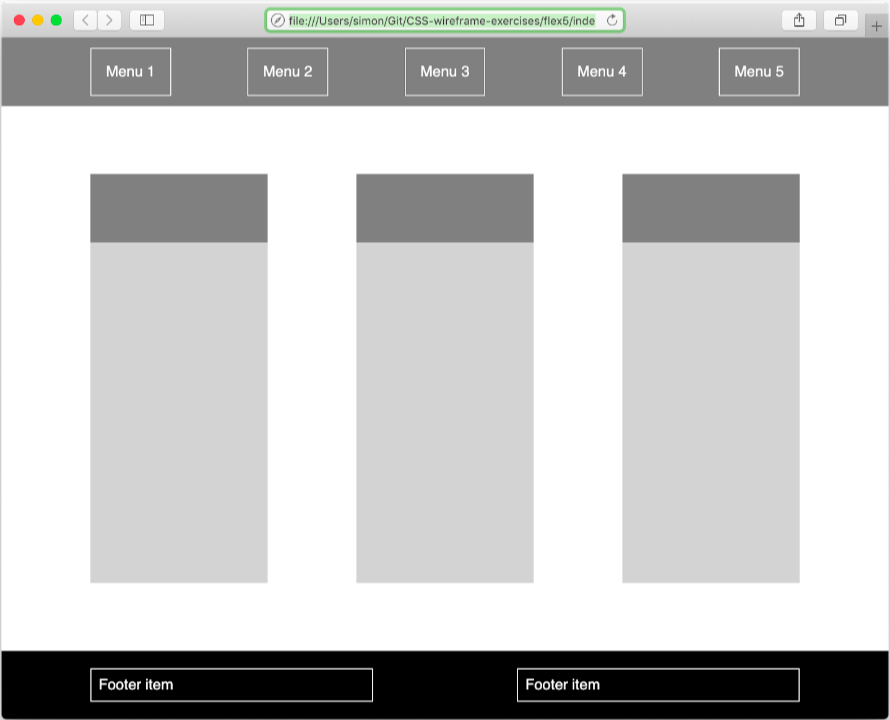

# flexbox-exercise

We have a skeleton for our website as the picture below, use what you have already learned about CSS Flexbox to make our website alive.

clone the repo, check index.html and work on style.css
